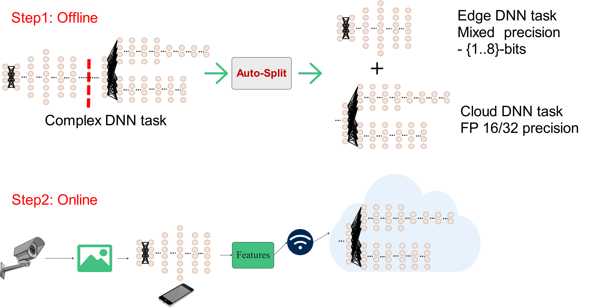
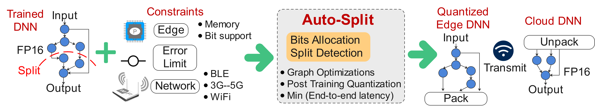

# Auto-Split: A General Framework of Collaborative Edge-Cloud AI

# Overview 
Auto split engine takes a DNN as input and finds the best split point 
to execute the initial DNN on the edge device and the later DNN on the cloud device 
to minimize end-to-end latency. Possible solutions can be :- 
* Execute everything on the edge device
* Execute everything on the cloud device 
* Distributed execution on edge and cloud.

##### Important note
The code in this repository is proof-of-concept code. It is by no means a production code.


##### Quantization support
For edge device, it also finds quantization statistics, and bit-width per layer
to apply various post training quantization techniques such as :-
* ACIQ
* LAPQ 

##### Reduced Transmission cost
At the split point, the auto-split engine parses  the DNN graph 
and collects the features to be transmitted to the cloud device 
at lower precision reducing the  total transmission cost.  

##### Cloud Device
Cloud device executes in floating point precision.


This figure provides the overview for Auto split engine. 



# Installation 

The [requirements.txt](requirements.txt) has been added for the packages used for this project. 
Note, that it is slightly different from the [distiller's  requirements.txt](libs/distiller-master/requirements.txt).
For anaconda users, an equivalent environment file is also present [pyt_13.yml](pyt_13.yml).
This project was tested with 
````
python==3.7.6 
pytorch==1.3.1
tensorflow==1.15
````

##### Distiller installation 
The readme to install and test distiller is present in 
[Distiller installation](libs/distiller-master/README.md)

##### Known issues
pycoco tools has a known issue with `numpy==1.18`. 
You need to downgrade to `numpy==1.17`

##### Environment Set up 

The root folder is `auto_split` and `distiller` is loaded as a library. 
````
cd ~/edge-cloud-collaboration/auto_split
export PYTHONPATH=export PYTHONPATH=~/edge-cloud-collaboration/auto_split:~/edge-cloud-collaboration/libs/distiller-master
````
# Face detection demo
* Proof of concept.
* [Face detection Readme](face_detection_demo/README.md)

# Image Classification workloads
The project supports image classification workloads from torchvision and has been tested on :- 
* Resnet family :- Resnet-18, Resnet-50, Resnext50_32x4d
* Mobilenet-v1, and Mobilenet-v2
* Mnasnet1_0
* GoogleNet

The readme for image classification models can be found in :- 
[Auto split README](auto_split/README.md)


# Object Detection:  YOLO-v3
* [YOLOv3 original README](auto_split/detection_models/yolov3_master/README2.md)
* [YOLOv3 project specific readme](auto_split/detection_models/yolov3_master/README.md)

